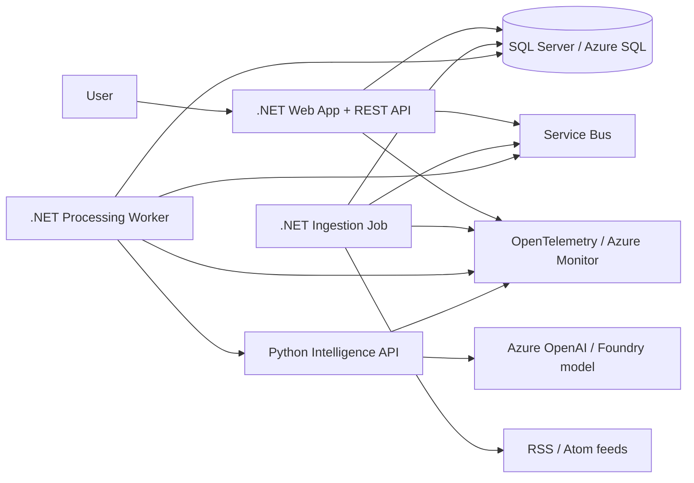
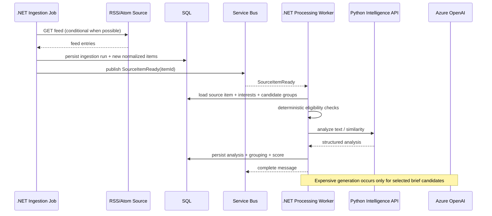

# Personal Tech Brief — System Design

**Status:** Approved baseline for implementation  
**Depends on:** `00-product-definition.md` through `08-spec-driven-development-workflow.md`

## 1. Architecture goals

The architecture must support the MVP while deliberately exercising the technical capabilities targeted by the project:

- production-style .NET backend development;
- Python software development beyond notebooks/scripts;
- REST API design;
- application design and separation of responsibilities;
- asynchronous processing and failure handling;
- SQL Server / Azure SQL persistence;
- cloud product selection and deployment reasoning;
- automated testing;
- GenAI used selectively rather than as a replacement for deterministic software.

The architecture must remain proportional to a personal-use MVP. Distributed components are introduced only where they create a real boundary or operational benefit.

## 2. High-level architecture

## 3. Component responsibilities

### 3.1 .NET Web Application

ASP.NET Core on .NET 10 LTS.

Responsibilities:

- expose the public REST API;
- host the small web UI for the MVP;
- manage interests and priorities;
- manage RSS/Atom sources;
- accept one-off article URLs;
- expose current brief and brief history;
- record Relevant / Not relevant / Save / Open actions;
- execute user-facing validation;
- expose health endpoints;
- coordinate application use cases without embedding infrastructure concerns.

The first version will use standard ASP.NET Core constructs directly rather than hiding the request pipeline behind an internal framework or MediatR. The purpose is to make routing, DI, middleware, validation, cancellation and error handling explicit.

### 3.2 .NET Ingestion Job

A finite background executable using the .NET Generic Host.

Responsibilities:

- load enabled sources due for ingestion;
- retrieve RSS/Atom feeds using conditional HTTP requests when supported (`ETag`, `Last-Modified`);
- normalize feed entries into the canonical source-item shape;
- perform exact/obvious deterministic duplicate detection;
- persist new source items and ingestion-run metadata;
- enqueue new items for downstream processing;
- isolate per-source failures so one broken feed does not invalidate unrelated feeds.

Cloud execution: scheduled Azure Container Apps Job.  
Local execution: explicit command or local scheduler only when useful.

### 3.3 .NET Processing Worker

Long-running .NET Worker Service.

Responsibilities:

- consume new-item messages from the processing queue;
- load the canonical source item;
- apply deterministic eligibility rules before expensive processing;
- call the Python Intelligence API;
- persist semantic-analysis results;
- evaluate/update grouping against recent candidate updates;
- compute deterministic relevance score from configured signals;
- transition processing state safely and idempotently;
- send failed messages through retry/dead-letter behavior without corrupting item state.

Cloud execution: Azure Container App with Service Bus/KEDA scaling.  
Local execution: container/process consuming the Service Bus emulator.

### 3.4 Python Intelligence API

FastAPI service on Python 3.14.

This service exists because text intelligence is a distinct capability, not merely to satisfy a technology requirement.

Responsibilities:

- typed REST contracts using Pydantic;
- text preprocessing and normalization suitable for semantic analysis;
- batch text-similarity calculation for grouping support;
- semantic content analysis where conventional text processing is insufficient;
- structured GenAI generation for the small set of selected updates;
- generation of concise update title, summary and human-readable relevance explanation;
- provider abstraction so tests do not require a live LLM;
- expose health/readiness endpoints.

The service is stateless with respect to product/domain data. It does not own interests, sources, briefs, feedback or persistence.

### 3.5 Relational database

Cloud: Azure SQL Database.  
Local: SQL Server container.

The database is owned by the .NET application boundary. The Python service does not connect directly to it.

Primary stored concepts:

- interests;
- sources;
- ingestion runs;
- source items;
- content analyses;
- technology updates/groups;
- source-to-update associations;
- relevance evaluation metadata;
- briefs and immutable brief-item snapshots;
- feedback/saved state;
- lightweight product-evaluation events.

### 3.6 Message broker

Cloud: Azure Service Bus queue.  
Local: Azure Service Bus emulator.

The initial queue is `content-processing`.

Purpose:

- decouple retrieval from slower semantic processing;
- allow ingestion to finish even when semantic/GenAI dependencies are slow;
- support retries and dead-letter diagnostics;
- allow the processing worker to scale independently;
- provide a concrete asynchronous-processing boundary.

The application must still enforce its own idempotency. Broker duplicate detection is an additional defense, not the domain's only duplicate strategy.

## 4. Main processing flow

## 5. Brief generation

Brief generation is domain/application behavior owned by .NET.

1. Select processed, eligible updates in the configured brief window.
2. Apply deterministic relevance scoring and threshold.
3. Rank candidates.
4. Select at most five.
5. If zero pass, persist a valid empty brief.
6. For selected candidates only, request structured generation from the Python service.
7. Persist an immutable brief-item snapshot containing what the user saw.
8. Expose the completed brief.

Brief generation may initially be invoked on demand from the API and later scheduled if useful. It must not require a live HTTP request to remain open while all candidate processing occurs.

## 6. Relevance model for MVP

The final selection score is deterministic and inspectable. Semantic analysis contributes signals but does not make the final product decision alone.

Initial signals:

- configured-interest match and interest priority;
- recency;
- analyzed impact/magnitude;
- number/diversity of supporting source items, capped to prevent popularity domination;
- penalties for incomplete/unreliable analysis where applicable.

Weights and minimum threshold are configuration/domain policy, not prompt text.

The score is not shown directly to the user. The user receives a human-readable relevance explanation.

## 7. Grouping strategy

Grouping occurs in layers:

1. deterministic exact/obvious duplicate checks using source identifier, canonical URL and content/title hashes;
2. candidate narrowing using recency and topic overlap;
3. Python batch text-similarity calculation against a bounded number of recent groups;
4. merge only when the configured similarity rule is met;
5. otherwise create a new technology update.

The MVP does not require vector infrastructure.

## 8. GenAI strategy

GenAI is used only where semantic generation adds value.

Primary MVP generation use:

- concise title for a selected grouped update;
- factual summary grounded in supplied source excerpts;
- explanation of why the update maps to configured interests.

Structured outputs are required. The service validates model output against typed schemas before returning it.

Prompts are versioned. Model/deployment name, prompt version and request correlation metadata are stored with generation records for traceability.

No model is allowed to create source facts that are not present in the supplied material.

## 9. UI strategy

The MVP uses a small Blazor-based UI hosted with the .NET web application to avoid adding an unrelated JavaScript framework/toolchain.

Required surfaces remain:

- Brief;
- History;
- Interests;
- Sources.

The REST API remains a first-class contract even though the initial UI is colocated with the .NET application.

## 10. Deployment architecture

Reference Azure deployment:

- Azure Container Apps — .NET web app;
- Azure Container Apps — .NET processing worker, scaled from Service Bus;
- Azure Container Apps Jobs — scheduled ingestion job;
- Azure Container Apps — internal-only Python Intelligence API;
- Azure SQL Database — relational persistence;
- Azure Service Bus — processing queue and DLQ;
- Azure OpenAI / Microsoft Foundry model endpoint — structured generation;
- Azure Key Vault — secrets that cannot use managed identity;
- Azure Container Registry — container images;
- Azure Monitor / Application Insights via OpenTelemetry — logs, traces and metrics;
- Microsoft Entra ID / Container Apps built-in auth — protect the single-user cloud UI/API;
- Bicep — infrastructure as code.

Managed identity is preferred for Azure-to-Azure authentication where supported.

## 11. Explicit non-decisions / deferred complexity

The MVP will not introduce:

- Kubernetes;
- Dapr;
- event sourcing;
- a vector database;
- a separate API gateway;
- Redis/cache unless measurements justify it;
- multiple queues/topics without a demonstrated need;
- direct Python access to product persistence;
- MediatR solely to reproduce a previous work framework;
- a separate SPA framework;
- microservices for each domain concept.

## 12. Technology baseline

- .NET 10 LTS;
- ASP.NET Core / EF Core matching the .NET major version;
- Python 3.14;
- FastAPI + Pydantic;
- SQL Server locally / Azure SQL Database in cloud;
- xUnit for .NET tests;
- pytest for Python tests;
- OpenTelemetry for cross-service telemetry;
- Docker/Compose for local infrastructure;
- Bicep for Azure infrastructure;
- GitHub Actions for CI once the repository is hosted on GitHub.

Exact third-party package patch versions are locked during repository bootstrap rather than hardcoded in this design document.

## 13. References used for technology selection

- .NET support policy: https://dotnet.microsoft.com/platform/support/policy
- Azure Container Apps jobs: https://learn.microsoft.com/azure/container-apps/jobs
- Azure Container Apps scaling: https://learn.microsoft.com/azure/container-apps/scale-app
- Azure Service Bus emulator: https://learn.microsoft.com/azure/service-bus-messaging/overview-emulator
- Azure SQL Database overview: https://learn.microsoft.com/azure/azure-sql/database/sql-database-paas-overview
- Container Apps authentication: https://learn.microsoft.com/azure/container-apps/authentication
- Container Apps secrets/Key Vault: https://learn.microsoft.com/azure/container-apps/manage-secrets
- Container Apps observability: https://learn.microsoft.com/azure/container-apps/observability
- Azure OpenAI structured outputs: https://learn.microsoft.com/azure/foundry/openai/how-to/structured-outputs
- Python 3.14 docs: https://docs.python.org/3.14/
